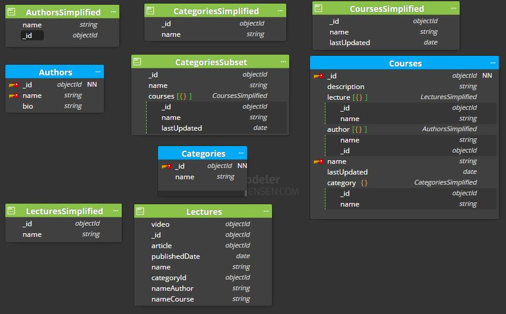

# MongoDB data modelling exercise 

Generate a model that reflects the following requeriments:

1. Show the latest courses published.
2. Show the courses per category (devops / front End ...).
3. Show a course and its lectures.
4. For a lecture, show its author.


## Solution structure 

```
├── 1.basic
│   ├── elearningPortal.dmm (new)	
│   ├── README.md (new)
│   README.md
```

The model has been implemented using Moon Modeler in the file elearningPortal.dmm. 

`MongoDB collections` are used to store the data (represented in blue).

`MongoDB documents` are objects that can be embedded in collections or other documents (represented in gree). A document is only a data description, no collection is created.

Note that for easier understanding, in the examples I am representing the _id as a number, instead of a GUID.

## Elearning Portal Model

1. In this e-portal application there is one-to-many relationship between course and lectures data, the course has multiple lectures documents.  One lecture can belong to only one course. 
   * We've used the `Embedded document pattern` including the lectures for each course to reduce the JOIN operation. 
   * We've used the `Extended ref pattern` to only access the lecture's data which is required by the application, `LecturesSimplified` with only the id and lecture's name,  instead of all fields from `Lectures` embedded data.
   * We also have used the `Subset pattern` to include only the course's five most recent lectures, instead of storing all of the lectures with the course. The `working set` is the data that your application is constantly requesting. If your “Working Set” all fits in RAM then all access will be fast as the operating system will not have to swap to and from disk as much. This way the working set is small and efficient.

   When an user visits a course page, the application loads the five most recent lectures very quick.

   There is one-to-one relationship between lecture and course data, the lecture belongs to only one course. 

2. There is also one-to-many relationship between category and courses data, the category has multiple courses entities. Please find more detailed information in below `Embedded Document Pattern` and `Subset Pattern` sections.
   There is one-to-one relationship between course and category data, the course belongs to only one category.

3. There is also one-to-many relationship between category and lectures data, the category has multiple lectures documents. 
   There is one-to-one relationship between lecture and category data, the lecture belongs to only one category.

4. There is also one-to-many relationship between author and lectures data, the author has multiple lectures documents. 
   There is one-to-one relationship between lecture and author data, the lecture is created by one author. 

5. There is also one-to-many relationship between author and courses data, the author has multiple lectures documents. 
   There is one-to-many relationship between course and author data, the course it might be created by more than one author. 
   Regarding the authors, we have got them per lecture and we also duplicated within course to simplified the queries.

Final model's collections and documents examples

```
// Categories collection
{
   _id: "1",
   name: "Back End"
}
```
```
// CategoriesSimplified document
{
   _id: "1",
   name: "Back End"
}
```
```
// CategoriesSubset document
{
   _id: "1",
   name: "Back End",
   courses: [
    {"_id": 786, "name": "The Complete Developers Guide to MongoDB", "lastUpdated": ISODate ("2022-04-21")},
    ...
   ]
}
```

```
// Authors collection
{
    _id: 1,
   name: "Braulio Díez",
   bio: "Desarrollador, ponente, formador y escritor, más de 15 años de experiencia en proyectos internacionales, apasionado del open source"
}
```

```
// AuthorsSimplified document
{
    _id: 1,
   name: "Braulio Díez"
}
```

```
// Lectures document
{
   _id: 10,  
   name: "Core Fundamentals of MongoDB",
   video: objectId("111f1f17bcf86cf123456789"),
   article: objectId("222f1f17bcf86cf123456789"),  
   publishedDate: ISODate ("2022-04-20"),
   categoryId: "1", 
   nameAuthor: "Braulio Díez",
   nameCourse: "The Complete Developers Guide to MongoDB"
}
```

```
// LecturesSimplified document
{
   _id: 10, 
   name: "Core Fundamentals of MongoDB",
   publishedDate: ISODate ("2022-04-20")
}
```

```
// CoursesSimplified document
{
   _id: "786",
   name: "The Complete Developers Guide to MongoDB",  
   lastUpdated: ISODate ("2022-04-21")
}
```

```   
// Courses collection
{  
   _id: "786", 
   name: "The Complete Developers Guide to MongoDB",
   description: "Who this course is for: MongoDB Developers or data scientists who are working on it or wanted to learn it.",
   lastUpdated: ISODate ("2022-04-21"),
   category: {"_id": "1", name: "Back End"}, 
   lecture: [
    { "_id": "1", name: "Let's Start", publishedDate: ISODate ("2022-04-01") }, 
    ...
    { "_id": "10", name: "Core Fundamentals of MongoDB", publishedDate: ISODate ("2022-04-20") },
    ...
   ],
   author: [
    { "_id": "1", name: "Braulio Díez" }, 
    { "_id": "2", name: "Daniel Sánchez" },
    ...
   ]
}
```




### Embedded Document Pattern

In this e-portal application there is one-to-many relationship between category and courses data, the category has multiple courses entities.

In the normalized data model, the courses collections contain a reference to the category collection.

```
// categories collection
{
   _id: "1", 
   name: "Back End"
}
```

```
// courses collection
{  
   _id: "786", 
   name: "The Complete Developers Guide to MongoDB",
   description: "Who this course is for: MongoDB Developers or data scientists who are working on it or wanted to learn it.",
   lastUpdated: ISODate ("2022-04-21"),
   category: {"_id": "1", name: "Back End"},
   lectures: [
    { "_id": "1", name: "Let's Start", publishedDate: ISODate ("2022-04-01") }, 
    ...
    { "_id": "10", name: "Core Fundamentals of MongoDB", publishedDate: ISODate ("2022-04-20")  ... },
    ...
   ]
},
{
   _id: "785", 
   name: "Complete NodeJS Developer in 2022 (GraphQL, MongoDB, + more)",
   description: "Learn from real NodeJS experts! Includes REALLY Advanced NodeJS, Express, GraphQL, REST, MongoDB, SQL, MERN + much more.",
   lastUpdated: ISODate ("2022-04-01"),
   category: {"_id": "1", name: "Back End"},
   lectures: [ { .. }, { .. }, ... ]  
},
...
{  
   _id: "781", 
   name: "Java Programming Masterclass covering Java 11 & Java 17",
   description: "Learn Java In This Course And Become a Computer Programmer. Obtain valuable Core Java Skills And Java Certification.",
   lastUpdated: ISODate ("2022-03-25"),
   category: {"_id": "1", name: "Back End"},
   lectures: [ { .. }, { .. }, ... ]
},
...
{  
   _id: "1", 
   name: "C# Basics for Beginners: Learn C# Fundamentals by Coding",
   description: "Master C# fundamentals in 6 hours - The most popular course with 50,000+ students, packed with tips and exercises.",
   lastUpdated: ISODate ("2022-01-21"),
   category: {"_id": "1", name: "Back End"},
   lectures: [ { .. }, { .. }, ... ]
}
```

Because the application frequently retrieves the courses data with the name (category) information, then it needs to issue multiple queries to resolve the references. A more optimal schema would be to embed the `courses` data entities in the `category` data. Applying also the `Extended ref pattern` to only access the course's data which is required by the application, in this model those fieds are `_id`, `name` and `LastUpdated` fields:

```
\\ CategoriesSubset document
{
   "_id": "1",
   "name": "Back End",
   "courses": [
     { "_id": 786, "name": "The Complete Developers Guide to MongoDB", lastUpdated: ISODate ("2022-04-21") },
     { "_id": 785, "name": "Complete NodeJS Developer in 2022 (GraphQL, MongoDB, + more)", lastUpdated: ISODate ("2022-04-01") },
      ...
     { "_id": 1, "name": "C# Basics for Beginners: Learn C# Fundamentals by Coding", lastUpdated: ISODate ("2022-01-21") }
   ]
 }
```

With the embedded data model, your application can retrieve the complete category information with one query.

### Subset pattern
A potential problem with the embedded document pattern is that it can lead to large documents. In this case, you can use the subset pattern to only access data which is required by the application, instead of the entire set of embedded data.

The courses are sorted in reverse chronological order. When an user visits a category page, the application loads the five most recent courses.

Instead of storing all of the courses with the category, you can split the collection into two collections:

The `categories` collection stores information on each category, including the category's five most recent courses.
```
{
   "_id": "1",
   "name": "Back End",
   "courses": [
     { "_id": 786, "name": "The Complete Developers Guide to MongoDB", lastUpdated: ISODate ("2022-04-21") },
     ...
     { "_id": 781, "name": "Java Programming Masterclass covering Java 11 & Java 17", lastUpdated: ISODate ("2022-03-25") }               
   ]
 }
```

The `courses` collection stores all courses. Each course contains a reference to the category for which it was written.
```
{
    category: {"_id": 1, "name: "Braulio Díez"},
    _id: "786",
    name: "The Complete Developers Guide to MongoDB",
    description: "Who this course is for: MongoDB Developers or data scientists who are working on it or wanted to learn it.",    
    ...
},
{
    category: {"_id": 2, "name: "Daniel Sánchez"},
    _id: "785",
    name: "Complete NodeJS Developer in 2022 (GraphQL, MongoDB, + more)",
    description: "Learn from real NodeJS experts! Includes REALLY Advanced NodeJS, Express, GraphQL, REST, MongoDB, SQL, MERN + much more.",
    ...
}
...
{
    category: {"_id": 3, "name: "Clara Ruiz"},
    _id: "1",
    name: "C# Basics for Beginners: Learn C# Fundamentals by Coding",
    description: "Master C# fundamentals in 6 hours - The most popular course with 50,000+ students, packed with tips and exercises.",     
    ...
}

```

### Extended ref pattern

In this e-portal application, the idea of an author exists, as does a lecture. They are separate logical entities.

Lectures document
```
{
   _id: 10,  
   name: "Core Fundamentals of MongoDB"
   video: objectId("111f1f17bcf86cf123456789"),
   article: objectId("222f1f17bcf86cf123456789"),  
   publishedDate: ISODate ("2022-04-20")
}
```

Authors collection
```
{
    _id: 1,
   name: "Braulio Díez",
   bio: "Desarrollador, ponente, formador y escritor, más de 15 años de experiencia en proyectos internacionales, apasionado del open source"
}
```

From a performance standpoint, however, this becomes problematic as we need to put the pieces of information together for a specific lecture. One author can have N lectures, creating a 1-N relationship. From an lecture standpoint, if we flip that around, they have an N-1 relationship with an author. Embedding all of the information about an author for each lecture just to reduce the JOIN operation results in a lot of duplicated information. Additionally, not all of the author information may be needed for a lecture.


The Extended Reference pattern provides a great way to handle these situations. Instead of duplicating all of the information on the author, I only copy the fields we access frequently. Instead of embedding all of the information or including a reference to JOIN the information, I only embed those fields of the highest priority and most frequently accessed, such as nameAuthor. In `authors` collection the `name` is an unique constraint to allow only a single document with the same value for the indexed key. 

Lectures document
```
{
    _id: 10,  
    name: "Core Fundamentals of MongoDB",
   video: objectId("111f1f17bcf86cf123456789"),
   article: objectId("222f1f17bcf86cf123456789"),   
   publishedDate: ISODate ("2022-04-20"),   
   nameAuthor: "Braulio Díez"
}
```

Similarly, one course can have N lectures. Embedding all of the information about a course for each lecture just to reduce the JOIN operation results in a lot of duplicated information. Additionally, not all of the course information may be needed for a lecture. I only embed the nameCourse because in `courses` collection the `name` is an unique constraint to allow only a single document with the same value for the indexed key. 

Lectures document
```
{
    _id: 10,
    name: "Core Fundamentals of MongoDB",
   video: objectId("111f1f17bcf86cf123456789"),
   article: objectId("222f1f17bcf86cf123456789"),   
   publishedDate: ISODate ("2022-04-20"),
   nameAuthor: "Braulio Díez",
   nameCourse: "The Complete Developers Guide to MongoDB"
}
```
