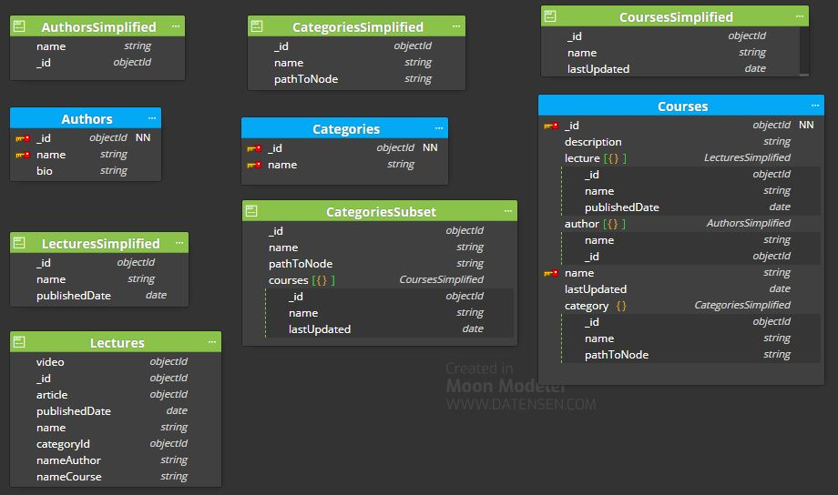

# MongoDB data modelling exercise 

Add to the basic model the following requeriments:

1. Add the following structured hierarchical/classified category data:
   Front End >> React
   Front End >> React >> Testing
   Front End >> Angular
   Devops >> Docker
   Devops >> Serverless
   Backend >> nodejs
   Backend >> nodejs >> Express
   Backend >> mongo

2. There might be public and private lectures, that means:
   A course can be 100% public.
   A course can have an initial part 100% public, and another only for subscriptors. 
   This implies there will be registered users and subscriptions.


## Solution structure 

```
├── 1.basic
│   ├── elearningPortal.dmm
│   ├── README.md
├── 2.advanced
│   ├── elearningPortalAdvanced.dmm (new)
│   ├── README.md (new)
│   README.md
```

MongoDB is a document based database. Each record in a collection is a document, and every document should be self-contained (it should contain all information that you need inside it).

To meet the first requirement we will use the Tree structure using Materialized Path. 

For each node we store (ID, PathToNode).

|Id | Ancestors|
|-- | --------|
|React | Front End|
|Testing | Front End, React|
|Angular | Front End|
|Docker | DevOps|
|Serverless | DevOps|
|nodejs | Back End|
|Express | Back End, nodejs|
|mongo | Back End|


Approach looks similar to storing array of ancestors, but we store a path in form of string instead. Note that I intentionally use comma(,) as a path elements divider in order to keep regular expression simpler.

We have modified the `CategoriesSimplified` and `CategoriesSubset` documents by adding the `pathToNode` field.
```
// CategoriesSimplified document
{
  "_id": "30"
  "name": "Express"",
  "pathToNode": "Backend, nodejs"
  ]
}
// CategoriesSubset document
 {
  "_id": "30",
  "name": "Express",
  "pathToNode": "Backend, nodejs",
  "courses": [
     {"_id": 785, "name": "Complete NodeJS Developer in 2022 (GraphQL, MongoDB, + more)", "lastUpdated": ISODate ("2022-04-01")},
    ...       
  ]
}
```

As we see the courses is an array of `CoursesSimplified` document nested within `CategoriesSubset` document. The number of courses is finite and known size (it is not be a ever growing one). Initially 10 courses, it is estimated to be 100 in one year and maximum 1000 in five years.
Another consideration is the size of the document limit of 16 MB. 




To meet the second requirement:
* we are modifying the current `Lectures` and `LecturesSimplified` document to add the isPrivate field.
* we are creating the `Users` collection, `UsersSimplified`, `UserCourse` and `UsersCourses` documents.

```
// Lectures document
{
   _id: 10,  
   name: "Core Fundamentals of MongoDB",
   video: objectId("111f1f17bcf86cf123456789"),
   article: objectId("222f1f17bcf86cf123456789"),  
   publishedDate: ISODate ("2022-04-20"),
   categoryId: "1", 
   nameAuthor: "Braulio Díez",
   nameCourse: "The Complete Developers Guide to MongoDB",
   isPrivate: false // by default
}

// LecturesSimplified document
{
   _id: 10, 
   name: "Core Fundamentals of MongoDB",
   publishedDate: ISODate ("2022-04-20"),
   isPrivate: false // by default
}
```

```
// Users collection
{
   _id: "1",
   name: "Pedro Jimenez",  
   userName: "pedro.Jimenez@hotmail.com", 
   passwordHash: "d131dd02c5e6eec4693d",
   plan: "None" // by default
},
{
   _id: "2",
   name: "Monica Suarez",  
   userName: "monica.suarez.1@gmail.com", 
   passwordHash: "f131dd02c5e6eec4693d",
   plan: "Basic"
}
```
```
// UsersSimplified document
{
   _id: "1",
   userName: "pedro.Jimenez@hotmail.com"
}

// UserCourse document
{
   user: { _id: 1, userName: "pedro.Jimenez@hotmail.com" } ,
   course: { "_id": 786, "name": "The Complete Developers Guide to MongoDB", lastUpdated: ISODate ("2022-04-21") }
}

// UsersCourses document
{
   usersCourses: [
      { 
         user: { _id: 1, userName: "pedro.Jimenez@hotmail.com" } ,
         course: { "_id": 786, "name": "The Complete Developers Guide to MongoDB", lastUpdated: ISODate ("2022-04-21") }
      },
      { 
         user: { _id: 2, userName: "monica.suarez.1@gmail.com" } ,
         course: { "_id": 786, "name": "The Complete Developers Guide to MongoDB", lastUpdated: ISODate ("2022-04-21") }
      },
      ...
   ]   
}
```

If the most common access pattern is finding what courses are more popular, you could 
* group them by course in `UsersCourses` document indexed by that course id.


