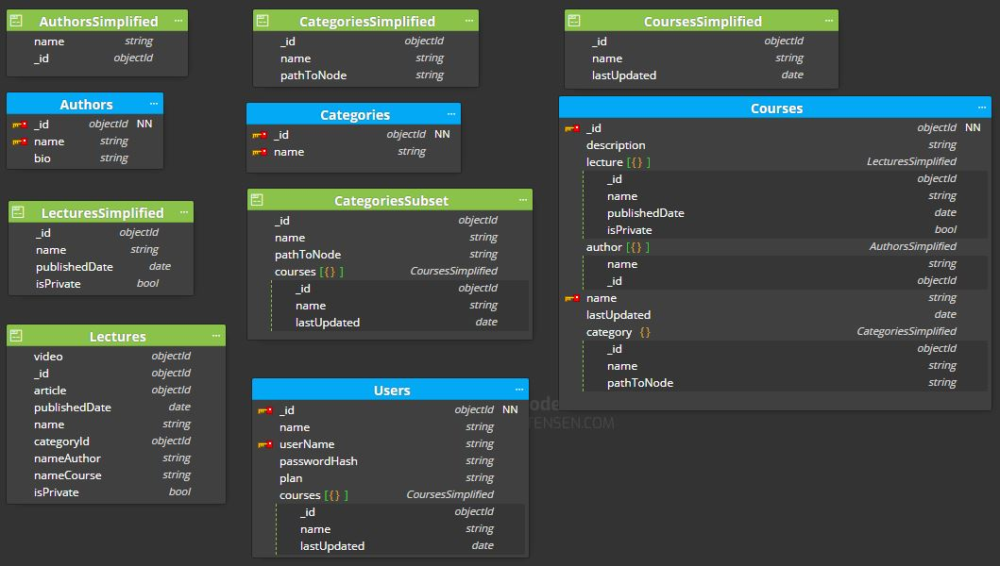

# MongoDB data modelling exercise 

Add to the basic model the following requeriments:

1. Add the following structured hierarchical/classified category data:
   Front End >> React
   Front End >> React >> Testing
   Front End >> Angular
   Devops >> Docker
   Devops >> Serverless
   Backend >> nodejs
   Backend >> nodejs >> Express
   Backend >> mongo

2. There might be public and private lectures, that means:
   A course can be 100% public.
   A course can have an initial part 100% public, and another only for subscriptors. 
   This implies there will be registered users and subscriptions.


## Solution structure 

```
├── 1.basic
│   ├── elearningPortal.dmm
│   ├── README.md
├── 2.advanced
│   ├── elearningPortalAdvanced.dmm (new)
│   ├── README.md (new)
│   README.md
```

MongoDB is a document based database. Each record in a collection is a document, and every document should be self-contained (it should contain all information that you need inside it).

To meet the first requirement we will use the Tree structure using Materialized Path. 

For each node we store (ID, PathToNode).

|Id | Ancestors|
|-- | --------|
|React | Front End|
|Testing | Front End, React|
|Angular | Front End|
|Docker | DevOps|
|Serverless | DevOps|
|nodejs | Back End|
|Express | Back End, nodejs|
|mongo | Back End|


This approach looks similar to storing array of ancestors, but we store a path in form of string instead. Note that I intentionally use comma(,) as a path elements divider in order to keep regular expression simpler.

We have modified the `CategoriesSimplified` and `CategoriesSubset` documents by adding the `pathToNode` field.
```not changed
// CoursesSimplified document
{
   _id: "786",
   name: "The Complete Developers Guide to MongoDB",  
   lastUpdated: ISODate ("2022-04-21")
}
```
```changed
// CategoriesSimplified document
{
  "_id": "30"
  "name": "Express"",
  "pathToNode": "Backend, nodejs"
  ]
}
// CategoriesSubset document
{
  "_id": "30",
  "name": "Express",
  "pathToNode": "Backend, nodejs",
  "courses": [
     {"_id": 785, "name": "Complete NodeJS Developer in 2022 (GraphQL, MongoDB, + more)", "lastUpdated": ISODate ("2022-04-01")},
    ...       
  ]
}
```

As we see the "courses" is an array of `CoursesSimplified` document nested within `CategoriesSubset` document. 

Note, the course _id and name are stored in both documents (`CoursesSimplified` and `CategoriesSubset`). This is duplication of data. This should be okay, as the duplicated details do not change often (or may not change at all).

You can just store the course _id field in the courses array, of the `CategoriesSubset` document; this is the case where you have course name field changes often. The queries will use Aggregation $lookup (a "join" operation) to get the course and from the courses collection.

The number of courses is finite and known size (it is not be a ever growing one). Initially 10 courses, it is estimated to be 100 in one year and maximum 1000 in five years.
Another consideration is the size of the document limit of 16 MB. 


To meet the second requirement:
* we are modifying the current `Lectures` and `LecturesSimplified` document to add the isPrivate field.
* we are creating the `Users`  and `UsersCourses` collections, and `UsersSimplified` and `UserCourse` documents.

```
// Lectures document
{
   _id: 10,  
   name: "Core Fundamentals of MongoDB",
   video: objectId("111f1f17bcf86cf123456789"),
   article: objectId("222f1f17bcf86cf123456789"),  
   publishedDate: ISODate ("2022-04-20"),
   categoryId: "1", 
   nameAuthor: "Braulio Díez",
   nameCourse: "The Complete Developers Guide to MongoDB",
   isPrivate: false // by default
}

// LecturesSimplified document
{
   _id: 10, 
   name: "Core Fundamentals of MongoDB",
   publishedDate: ISODate ("2022-04-20"),
   isPrivate: false // by default
}
```

```
// Users collection
{
   _id: "1",
   name: "Pedro Jimenez",  
   userName: "pedro.Jimenez@hotmail.com", 
   passwordHash: "d131dd02c5e6eec4693d",
   plan: "None" // by default
},
{
   _id: "2",
   name: "Monica Suarez",  
   userName: "monica.suarez.1@gmail.com", 
   passwordHash: "f131dd02c5e6eec4693d",
   plan: "Basic"
}
```
```
// UsersSimplified document
{
   _id: "1",
   userName: "pedro.Jimenez@hotmail.com"
}

// UserCourse document
{
   user: { _id: 1, userName: "pedro.Jimenez@hotmail.com" } ,
   course: { "_id": 786, "name": "The Complete Developers Guide to MongoDB", lastUpdated: ISODate ("2022-04-21") }
}

// UsersCourses collection
{
   usersCourses: [
      { 
         user: { _id: 1, userName: "pedro.Jimenez@hotmail.com" } ,
         course: { "_id": 786, "name": "The Complete Developers Guide to MongoDB", lastUpdated: ISODate ("2022-04-21") }
      },
      { 
         user: { _id: 2, userName: "monica.suarez.1@gmail.com" } ,
         course: { "_id": 786, "name": "The Complete Developers Guide to MongoDB", lastUpdated: ISODate ("2022-04-21") }
      },
      ...
   ]   
}
```

If the most common access pattern is finding what courses are more popular, you could 
* group them by course in `UsersCourses` document indexed by that course id.


Another approach to design the Many-to-Many relationship between courses and users would be to store only the user registered in `UsersRegistered` collection and to have the course details embedded with each registered user as an array of sub-documents called as courses.

```
/ UsersRegistered collection
{
   _id: "1",
   name: "Pedro Jimenez",  
   userName: "pedro.Jimenez@hotmail.com", 
   passwordHash: "d131dd02c5e6eec4693d",
   course: [
     { 
      "_id": 786, "name": "The Complete Developers Guide to MongoDB", lastUpdated: ISODate ("2022-04-21") 
     },
     {
      "_id": "785", "name": "Complete NodeJS Developer in 2022 (GraphQL, MongoDB, + more)", lastUpdated: ISODate ("2022-04-01")
     }
   ]
}
```

An user, may have been registered to upto 1000s of courses (maximum 1000 in five years). An ObjectId being 12 bytes long, in this case will grow a collection to a size of merely 12000 bytes which is way lesser than 16000000 bytes (16MB). You are still left with a lot of space for the rest of user fields. So no need to worry about hitting the cap of 16MB.


Query all courses a user is enrolled into, for example: db.UsersRegistered.find( { username: "pedro.Jimenez@hotmail.com" } ). This will return one user document with the matching name and all the courses (the array field). See https://www.mongodb.com/docs/manual/reference/method/db.collection.find/

Query all users enrolled into a particular course: db.UsersRegistered.find( { "courses.name": "The Complete Developers Guide to MongoDB" } ). This will return all the users documents who have the course name matching the criteria "The Complete Developers Guide to MongoDB". See https://www.mongodb.com/docs/manual/tutorial/query-array-of-documents/


